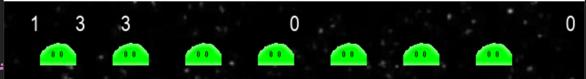
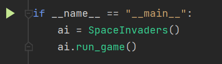

SPACE INVADERS

Игра в жанре shoot 'em up. Цель игры - расстрелять армады пришельцев,
набрать как можно больше очков.

Механика:

Армада пришельцев постепенно продвигается к низу экрана, наступая на маленький
кораблик, призванный защитить галактику от нашествия пришельцев.
За каждую расстрелянную армаду добавляется уровень. На каждом уровне, кратном
пяти, появляется особый вид пришельца - мистический. С его помощью
можно восстановить запас суперснарядов.
У главного героя, маленького кораблика, есть 3 жизни.

Игровая статистика:

Самая левая цифра - текущий уровень игрока. Далее идёт количество жизней
и следом - запас суперснарядов. Цифра в центре - максимальное
количество очков, набранное за все игры. Цифра справа - текущее количество
очков в этой игре.

За каждого убитого пришельца даётся 50 очков. Игрок теряет жизни,
когда пришелец сталкивается с кораблём или с нижней частью экрана.

Управление:
1. Начать игру (или поставить её на паузу) можно с помощью кнопки P.
2. Перемещение происходит за счёт стрелок
3. Выстрел происходит с помощью пробела
4. С помощью кнопки B можно выпустить суперснаряд. Их ограниченное количество в начале игры
5. С помощью кнопки ESC можно выйти из игры.

Запуск игры:

В файлe Space_Invaders.py запустите следующую функцию:
